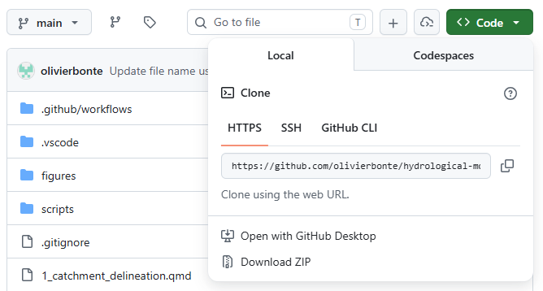

# Practical information {#sec-practical-info}

Before diving into the exercises, some practical information is provided on how to effectively set up your working environment.

## The repository

All code used to create this assignment is available at [https://github.com/olivierbonte/hydrological-modelling](https://github.com/olivierbonte/hydrological-modelling). This collection of files is called a repository. To get started, go the the URL above, click on the green `Code` button and select `Download ZIP` (see @fig-screenshot-download-button). Unzip the downloaded file and place the resulting folder at a location of your choice. This folder contains all the files you need to complete the exercises.

{#fig-screenshot-download-button}

Note that only the code, but also the processed data is now downloaded. You can find this data in `data/processed`. More info on the data sources and processing is given in @sec-study-area. 

This assignment is provided to you in two formats, up to you which one you prefer to work with:

1. A website at [https://olivierbonte.github.io/hydrological-modelling/](https://olivierbonte.github.io/hydrological-modelling/)
2. A PDF document, which you can download from [https://olivierbonte.github.io/hydrological-modelling/Exercises-Hydrological-Modelling.pdf](https://olivierbonte.github.io/hydrological-modelling/Exercises-Hydrological-Modelling.pdf)

## Working with Quarto and Python 

A general introduction to Quarto and Python is given in... LINK TO DEPARTMENT WIDE INTRO HERE LATER. 

The idea of this exercise set is that you will use [Quarto](https://quarto.org/) to combine your code and your scientific report in a single document. The goal is to write a report following the principles of [reproducible research](https://open-science-training-handbook.github.io/Open-Science-Training-Handbook_EN/02OpenScienceBasics/04ReproducibleResearchAndDataAnalysis.html)^[This concept is introduced in your course on [Data Science](https://studiekiezer.ugent.be/2026/studiefiche/en/I002440) in the 2nd Bachelor year of Bioscience Engineering, where you made a Quarto/Rmarkdown presentation/report for a data analysis], where others have access to all the data and code needed to obtain the same results as the one you present. 

In these practicals, you will therefore **not** write a report from scratch (in Microsoft Word, Google Docs...), but instead you'll extend the provided `.qmd` files for each exercise. The files of interested are numbered from `1_...qmd` to `6_...qmd`. Here you can add  [Python code](https://quarto.org/docs/computations/python.html)^[As an example of how this is used in practice, see e.g. the source file `0_study_area_and_data.qmd` for @sec-study-area] for your figures and write your discussion in [Markdown](https://quarto.org/docs/authoring/markdown-basics.html).  

::: {.callout-tip}

Don't perform al your computations inside of the `.qmd` files! Instead, make a regular `.py` file inside of the `src` folder for each exercise. From these `.py` files, you can save the results (e.g. metrics, output data) in (for example) a `data/results` folder. From this folder, you can then import the necessary results in the `.qmd` files to write your report and make your figures. 
:::

## Evaluation 

Hand in your report of this assignment via Ufora by ADD DATE LATER. Please hand in:

- A PDF version of your report, which is rendered via Quarto. 
- The full set of files (i.e. repository) including your solution as a `.zip` file. 

Your report should we written **scientifically** and should contain at least the following:

- A summary of the results with reference to relevant figures and metrics, and a proper discussion. Note that all tasks are related and that the results should be discussed in reference to one another in a scientific manner. The emphasis of the report should be on this part. This part should be used to draw the attention on shortcomings of the different algorithms and make a link to potential alternatives. Use the sections `Results and discussion` in `1...qmd` to `5...qmd` for writing this part down. 
- A conclusion about the modelling exercise as a whole, which is written in the `6_conclusion.qmd` file.
- To support your discussion, it is valuable to include references to relevant scientific papers. To add a reference, please include the relevant source in its bibxtex format to `references.bib`. More information on how to handle citations in Quarto can be found [here](https://quarto.org/docs/authoring/citations.html). The bibtex format is explained in [this guide](https://www.overleaf.com/learn/latex/Bibliography_management_with_biblatex#The_bibliography_file). By means of example, one scientific article, @moore2007, is already included. 