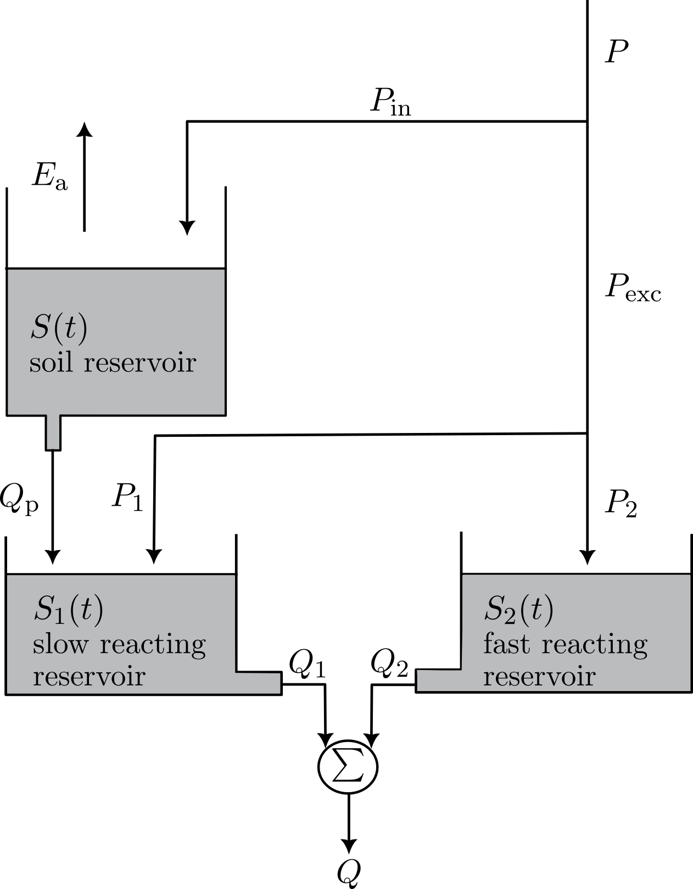

# Exercise 2: Implementation of the model {#sec-implementation}

## Assignment

The lumped, conceptual rainfall-runoff model implemented here is a simplified and modified version of the FLEX model as described in @fenicia2006 and @fenicia2008. The simplifications include not considering an interception reservoir and omitting lag functions for the routing. An overview of the model structure is given ADD FIGURE. The model considers three state variables, corresponding to the volume of water in three reservoirs:

1. The unsaturated soil reservoir $S(t)$ [mm]
2. The fast reacting reservoir $S_1(t)$ [mm]
3. The slow reacting reservoir $S_2(t)$ [mm] , conceptually representing the groundwater system

{width=60%}

The model is forced with precipitation $P(t)$ and potential evaporation $E_p(t)$ (see @sec-study-area-forcings-discharge for details on the forcing data). Note that mm is used as a unit here, as it allows to implement the model independently of the catchment area^[$1 \mathrm{ mm} = 1 \cdot 10^{-3} \mathrm{ m}^3 / \mathrm{m}^2$]

| **Parameter** | **Units** | **Minimum** | **Maximum** | **Value** |
|---|---:|---:|---:|---:|
| $\lambda$ | - | 0.5 | 1.5 | 0.65 |
| $S_{\mathrm{max}}$ | m$^3$ | $1\cdot10^7$ | $5\cdot10^7$ | $4\cdot10^7$ |
| $b$ | - | 0.5 | 1 | 0.86 |
| $\alpha$ | - | 1 | 1.5 | 1.11 |
| $Q_{\mathrm{p,max}}$ | m$^3$/s | 1 | 100 | 45 |
| $\beta$ | - | 0.05 | 0.1 | 0.06 |
| $\gamma$ | - | 5 | 10 | 9.84 |
| $S_{2,\mathrm{max}}$ | m$^3$ | $1.5\cdot10^6$ | $3\cdot10^6$ | $1.6\cdot10^6$ |
| $\kappa_2$ | m$^3$/s | 100 | 250 | 147 |
| $\kappa_1$ | s$^{-1}$ | $3\cdot10^{-6}$ | $6\cdot10^{-6}$ | $3.75\cdot10^{-6}$ |

: Model parameters together with their units, minimum and maximum value, and a set of uncalibrated values. **Note:** $S_{2,\mathrm{max}}$ can be used as maximum capacity of both the slow and fast reacting reservoir. {#tbl-parameters}

By applying the conservation of mass to each reservoir, three ordinary differential equations can be derived to describe the change in storage in each reservoir over time.

$$
\frac{dS(t)}{dt} = P_{\mathrm{in}}(t) - E_{\mathrm{a}}(t) - Q_{\mathrm{p}}(t)
$${#eq-soil-reservoir}
$$
\frac{dS_1(t)}{dt} = P_1(t) - Q_1(t) + Q_{\mathrm{p}}(t)
$$ {#eq-fast-reacting-reservoir}
$$
\frac{dS_2(t)}{dt} = P_2(t) - Q_2(t)
$$ {#eq-slow-reacting-reservoir}

In the equations above, a number of fluxes are calculated which depend on the state variables themselves. A first flux is the actual evaporation ($E_{\mathrm{a}}$ [mm/d]), which can be calculated from the potential evaporation $E_{\mathrm{p}}$ as follows:

$$
E_{\mathrm{a}}(t) = \frac{1}{\lambda}\frac{S(t)}{S_{\mathrm{max}}}E_{\mathrm{p}}(t)
$$ {#eq-actual-evaporation}

where $\lambda$ [-] is a dimensionless model parameter and $S_{\mathrm{max}}$ [mm] is the storage capacity of the unsaturated soil reservoir $S(t)$. The infiltration in the soil reservoir $P_{\mathrm{in}}$ [mm/d] is calculated using:

$$
P_{\mathrm{in}}(t) = \left(1 - \frac{S(t)}{S_{\mathrm{max}}}\right)^b P(t)
$$ {#eq-infiltration}

where $b$ is again a dimensionless model parameter. Subsequently, the excess precipitation $P_{\mathrm{exc}}$ [mm/d] can be estimated:

$$
P_{\mathrm{exc}}(t) = P(t) - P_{\mathrm{in}}(t)
$$ {#eq-excess-precipitation}

The amount of water percolating to the groundwater storage $Q_{\mathrm{p}}$ [mm/d] is:

$$
Q_{\mathrm{p}}(t)=Q_{\mathrm{p,max}}\left(1-e^{-\beta\frac{S(t)}{S_{\mathrm{max}}}}\right)
$$ {#eq-percolation}

with $Q_{\mathrm{p,max}}$ [mm/d] the maximum percolation volume per unit of time and $\beta$ [-] a dimensionless parameter. 

$P_{\mathrm{exc}}$ is again partitioned between $S_2$ and $S_1$:
$$
P_{\mathrm{exc}}(t) = P_1(t) + P_2(t)
$$ {#eq-partitioning-excess-precipitation}
The part of the effective precipitation reaching $S_2$ is:

$$
P_2(t) = \alpha\frac{S(t)}{S_{\mathrm{max}}}P_{\mathrm{eff}}(t)
$$

with $\alpha$ [-] a dimensionless model parameter. $P_1$ is then calculated as the remaining part of the effective precipitation using @eq-partitioning-excess-precipitation.

$S_2$ is considered as a non-linear reservoir, so that its outflow $Q_2$ [mm/d] can be calculated using:

$$
Q_2(t) = \kappa_2\left(\frac{S_2(t)}{S_{2,\mathrm{max}}}\right)^\gamma
$$ {#eq-fast-reacting-outflow}

with $S_{2,\mathrm{max}}$ [mm] the storage capacity of the fast reacting reservoir, $\kappa_2$ [mm/d] the maximum outflow rate, and $\gamma$ [-] a dimensionless model parameter.

$S_1$ on the other hand is considered as a linear reservoir, so  the outflow $Q_1$ [mm/d] is given by:
$$
Q_1(t) = \kappa_1 S_1(t)
$$ {#eq-slow-reacting-outflow}

where $\kappa_1$ [1/d] the reciprocal of the residence time. The total discharge $Q$ [mm/d] is then calculated as the sum of the outflow from the fast and slow reacting reservoir:
$$
Q(t) = Q_1(t) + Q_2(t)
$$ {#eq-discharge}

@eq-soil-reservoir, @eq-fast-reacting-reservoir, and @eq-slow-reacting-reservoir can be denoted as a general non-linear, continuous-time state-space model:
$$
\frac{d\mathbf{x}}{dt} = \mathcal{f}(\mathbf{x}, \mathbf{{f}}, \mathbf{p})
$$

with $f$ a non-linear function, $\mathbf{x} = [S, S_1, S_2]^T$ the state vector, $\mathbf{f} = [P, E_p]^T$ the forcing vector, and $\mathbf{p} = [\lambda, S_{\mathrm{max}}, b, \alpha, Q_{\mathrm{p,max}}, \beta, \gamma, S_{2,\mathrm{max}}, \kappa_2, \kappa_1]^T$ the parameter vector. For this exercise, the model will be implemented in discrete time using a simple forward Euler scheme^[For more background info on numerical methods for ordinary differential equation, see your [bachelor course on differential equations](https://studiekiezer.ugent.be/2025/studiefiche/en/I002428)]:
$$
\mathbf{x}(t+\Delta t) = \mathbf{x}(t) + \mathcal{f}(\mathbf{x}(t), \mathbf{{f}}(t), \mathbf{p})\Delta t
$$
The time step $\Delta t$ is set to 1 day, which is the same as the time step of the forcing data. 

With all of the information above, implement the model based on @eq-soil-reservoir to @eq-discharge. As a start, run it with the uncalibrated parameter values given in @tbl-parameters. Compare the simulated discharge with the observed discharge (see @sec-study-area-forcings-discharge). Discuss the performance using relevant figures and metrics. 

::: {.callout-tip}

Some general tips and recommendations:

- Implement the model in a separate file `scripts/model.py` as a function. You need to be able to reuse the model in the following exercises. 
- Make sure you can run the model one time step at a time. A for-loop can then be used to run the model for the entire time period.
- Take into account the physical limitations of the state variables. 
- Take into account the impact of initialisation of the state variables

:::

## Results and discussion

